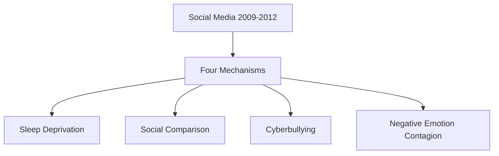

# Social Media Cost Calculator - Project Instructions

## Project Overview

### Objective
Build an interactive web application that calculates the hidden economic costs of social media to society, demonstrating to capitalists and policymakers that traditional GDP measurements miss trillions of dollars in social value related to human flourishing, mental health, and well-being.

### Core Mission
- **Primary Goal**: Convince capitalists that there are more valuable things in life than what GDP captures
- **Key Argument**: Social media has caused $2+ trillion in hidden economic damage since 2009
- **Value Gap**: VSL ($7-20M per person) minus lifetime income ($2M) = $5-18M in unmeasured human value
- **Target Audience**: Business leaders, economists, policymakers who focus on GDP metrics

## Technical Architecture

### Technology Stack
- **Frontend**: Pure HTML5, CSS3, JavaScript (ES6+)
- **Charts**: Chart.js 3.9.1+ for interactive visualizations
- **Diagrams**: Mermaid.js for causal pathway DAGs
- **Styling**: Custom CSS with gradient backgrounds, responsive design
- **Deployment**: Static hosting (Vercel, Netlify, GitHub Pages)

### Core Features Required

#### 1. Interactive Cost Calculator
```javascript
// Three main cost categories with P × Q × R formulas
const costCategories = {
  mortality: "P(Suicides) × Q(Attribution%) × R(VSL)",
  mentalHealth: "P(People) × Q(Years) × R(Quality Loss) × (VSL/75)",
  healthcare: "P(People) × Q(Annual Costs) × R(Duration)"
};
```

#### 2. Real-Time Cost Clock
- Shows accumulating costs since page load
- Updates every 100ms for smooth animation
- Displays cost per second based on annual calculations
- Default: ~$66,000 per second

#### 3. Research-Based Causal DAG


#### 4. Timeline Visualization
- Cumulative costs 2009-2024
- Shows exponential growth pattern
- Multiple cost streams with different line styles
- Interactive response to slider changes

## Research Foundation

### Key Academic Sources
1. **Twenge et al. (2018)** - <a href="https://doi.org/10.1177/2167702617723376" target="_blank" rel="noopener">Depression/suicide increases post-2010</a>
2. **Banzhaf (2022)** - <a href="https://doi.org/10.1017/bca.2022.9" target="_blank" rel="noopener">Value of Statistical Life meta-analysis</a>
3. **Haidt & Rausch (2022)** - <a href="https://www.nature.com/articles/s41562-022-01496-3" target="_blank" rel="noopener">Social Media Mental Health collaborative review</a>
4. **NSDUH 2019** - <a href="https://www.samhsa.gov/data/sites/default/files/reports/rpt35325/NSDUHFFRPDFWHTMLFiles2019/2019NSDUHFFR1PDFW102120.pdf" target="_blank" rel="noopener">Depression prevalence data</a>
5. **Christakis & Fowler** - <a href="https://www.pnas.org/doi/10.1073/pnas.0705825104" target="_blank" rel="noopener">Network effects theory</a>

### Four Validated Mechanisms (Bradley Riew Framework)
1. **Sleep Deprivation** - <a href="https://www.ncbi.nlm.nih.gov/pmc/articles/PMC6779597/" target="_blank" rel="noopener">Documented circadian disruption</a>
2. **Social Comparison** - <a href="https://journals.sagepub.com/doi/10.1177/1745691612460681" target="_blank" rel="noopener">Upward comparison effects</a>
3. **Cyberbullying** - <a href="https://www.ncbi.nlm.nih.gov/pmc/articles/PMC4387050/" target="_blank" rel="noopener">Direct harassment pathways</a>
4. **Negative Emotion Contagion** - <a href="https://www.pnas.org/doi/10.1073/pnas.1320040111" target="_blank" rel="noopener">Viral spread of negative emotions</a>

### Critical Timeline
- **2007**: iPhone launch
- **2009-2012**: "Social media became more addictive and toxic"
- **2010**: Instagram launch
- **2012+**: Sharp rise in teen depression (especially girls)
- **2024**: Current accumulated costs

## Implementation Details

### Slider Configuration
```javascript
const sliders = {
  // High confidence parameters
  vsl: { min: 7, max: 20, default: 10, step: 0.5, unit: "M" },
  
  // Medium confidence parameters  
  suicides: { min: 100000, max: 500000, default: 300000, step: 10000 },
  depression: { min: 5000000, max: 30000000, default: 15000000, step: 500000 },
  
  // Low confidence parameters
  attribution: { min: 10, max: 50, default: 25, step: 1, unit: "%" }
};
```

### Formula Display Requirements
- Show clear P × Q × R structure
- Real-time updates with slider changes
- Consistent number formatting (e.g., "$750.0B")
- Color-coded by cost category

### Chart Specifications

#### Timeline Chart
- X-axis: Years 2009-2024
- Y-axis: Cumulative costs (Billions USD)
- Four data series:
  - Total (thick red line, filled)
  - Mortality (dashed red)
  - Mental Health (dashed purple) 
  - Healthcare (dashed blue)

#### Pie Chart
- Three segments with research-backed colors
- Real-time updates
- Percentage labels on hover

## Content Requirements

### Key Messaging
1. **Opening Hook**: "Beyond GDP: Measuring Hidden Economic Impact"
2. **Value Gap**: "$5-18M per person in unmeasured value"
3. **Scale**: "$2+ trillion since social media adoption"
4. **Percentage**: "~8.7% of US GDP"

### Research Citations
- All parameters must link to actual studies
- Include DOI links where available
- Conservative estimates with uncertainty acknowledgment
- Transparent methodology section

### Visual Design Principles
- **Professional**: Clean, business-appropriate styling
- **Credible**: Academic citations, conservative estimates
- **Impactful**: Large numbers, compelling visualizations
- **Interactive**: Immediate feedback on parameter changes

## Development Guidelines

### Code Quality Standards
```javascript
// Error handling for all functions
function safeCalculation() {
  try {
    // Main logic
  } catch (error) {
    console.warn('Calculation failed, using fallback');
    return fallbackValue;
  }
}

// Consistent number formatting
function formatCurrency(num) {
  if (num >= 1e12) return '$' + (num / 1e12).toFixed(1) + 'T';
  if (num >= 1e9) return '$' + (num / 1e9).toFixed(1) + 'B';
  // etc.
}
```

### Responsive Design Requirements
- Mobile-first approach
- Breakpoints at 768px, 1200px, 1400px
- Stacked layout on mobile
- Touch-friendly sliders

### Performance Considerations
- Debounced chart updates (avoid excessive redraws)
- Efficient DOM queries (cache selectors)
- Lazy chart initialization
- Fallback if charts fail to load

## Deployment Configuration

### Vercel Setup
```json
{
  "version": 2,
  "builds": [
    {
      "src": "index.html",
      "use": "@vercel/static"
    }
  ],
  "routes": [
    {
      "src": "/(.*)",
      "dest": "/index.html"
    }
  ]
}
```

### Environment Variables
```bash
# Analytics (optional)
VERCEL_ANALYTICS_ID=your_id

# Domain configuration
CUSTOM_DOMAIN=socialmediacosts.com
```

## File Structure
```
project-root/
├── index.html              # Main calculator page
├── assets/
│   ├── css/
│   │   └── styles.css      # Main stylesheet
│   ├── js/
│   │   ├── calculator.js   # Core calculations
│   │   ├── charts.js       # Chart management
│   │   └── utils.js        # Helper functions
│   └── data/
│       └── research.json   # Citation database
├── docs/
│   ├── methodology.md      # Research methodology
│   ├── sources.md          # Complete citation list
│   └── changelog.md        # Version history
├── vercel.json             # Deployment config
└── README.md               # Project documentation
```

## Testing Requirements

### User Acceptance Criteria
- [ ] All sliders update calculations immediately
- [ ] Clock shows smooth cost accumulation
- [ ] Charts respond to parameter changes
- [ ] All links work and open in new tabs
- [ ] Mobile layout functions properly
- [ ] Page loads without JavaScript errors
- [ ] Numbers consistent across all sections

### Browser Compatibility
- Chrome 90+
- Firefox 88+
- Safari 14+
- Edge 90+

### Performance Targets
- First Contentful Paint: < 2s
- Largest Contentful Paint: < 3s
- Chart initialization: < 1s
- Slider response time: < 100ms

## Content Strategy

### SEO Optimization
```html
<meta name="description" content="Calculate the true economic cost of social media: $2+ trillion in hidden social value that GDP doesn't measure.">
<meta name="keywords" content="social media cost, GDP alternatives, value of statistical life, mental health economics">
```

### Social Sharing
- Open Graph tags for social media previews
- Twitter Card meta tags
- Compelling preview images showing key statistics

## Future Enhancement Roadmap

### Phase 2 Features
- Regional data (EU, UK, Canada)
- Export functionality (PDF reports)
- Scenario comparison tool
- Academic paper integration

### Phase 3 Features  
- Real-time data feeds
- Policy impact calculator
- Cost-benefit analysis tools
- Multi-language support

## Success Metrics

### Engagement Targets
- Average time on page: > 3 minutes
- Slider interactions: > 5 per session
- Citation click-through: > 10%
- Social shares: Track viral coefficient

### Impact Goals
- Policy maker awareness
- Academic citations
- Media coverage
- Corporate adoption of broader value metrics

## Risk Mitigation

### Technical Risks
- Chart.js dependency failure → Fallback static images
- Calculation errors → Conservative bounds checking
- Mobile performance → Progressive enhancement

### Content Risks
- Research challenges → Multiple source validation
- Bias accusations → Transparent methodology
- Oversimplification → Detailed technical appendix

This calculator serves as a powerful tool to demonstrate that human flourishing, mental health, and social well-being have massive economic value that traditional GDP measurements completely miss—making the case for a more holistic approach to measuring societal progress.